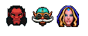

[](https://badge.fury.io/js/dota2-minimap-hero-sprites) [](https://david-dm.org/bontscho/dota2-minimap-hero-sprites) [](https://david-dm.org/bontscho/dota2-minimap-hero-sprites?type=dev)

# Dota2 Minimap Hero Sprites

This is a CSS spritesheet for Dota 2 Minimap Hero Icons.

## Demo & Usage

Add class `d2mh` to `<i>` tag and reference the wanted hero by adding an additional class in the format of `<heroname>`, `npc_dota_hero_<heroname>` or `hero-<hero_id>`:

``` html
<i class="d2mh axe"></i>
<i class="d2mh npc_dota_hero_gyrocopter"></i>
<i class="d2mh hero-5"></i>
```

### Output:



## Installation

### a) npm

Install via npm:

```
npm install dota2-minimap-hero-sprites
```

And embed the stylesheet:
``` html
<link rel="stylesheet" type="text/css" href="./node_modules/dota2-minimap-hero-sprites/assets/stylesheets/dota2minimapheroes.css">
```

### b) copy files

Just copy the assets folder and link to the stylesheet in your HTML like above.

## For Contributors: Update Workflow

1. Update `src/heroes.json` with latest json output from `http://api.steampowered.com/IEconDOTA2_570/GetHeroes/v1?language=en_us&key=<your steam web api key>`
2. Extract `materials/vgui/hud/minimap_hero_sheet[...].vtex_c` from Dota 2 pak files and decompile to `assets/images/minimap_hero_sheet.png` (GCFScape + ValveResourceFormat)
3. Extract `scripts/mod_textures.txt` from Dota 2 pak files to `src/mod_textures.txt` (GCFScape)
4. Run `npm install` to get the required packages for the generator script
5. Run `npm run generate`

### Tools

Tools I used: [GCFScape](http://nemesis.thewavelength.net/index.php?p=26), [ValveResourceFormat](https://github.com/SteamDatabase/ValveResourceFormat)

Get Steam WebAPI Key from: http://steamcommunity.com/dev

Full List of Third Party Tools: https://developer.valvesoftware.com/wiki/Category:Third_Party_Tools

----------------

All game images and names are property of Valve Corporation.
